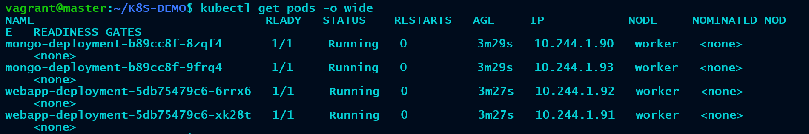
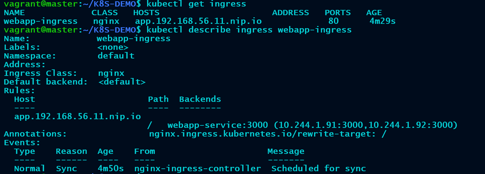
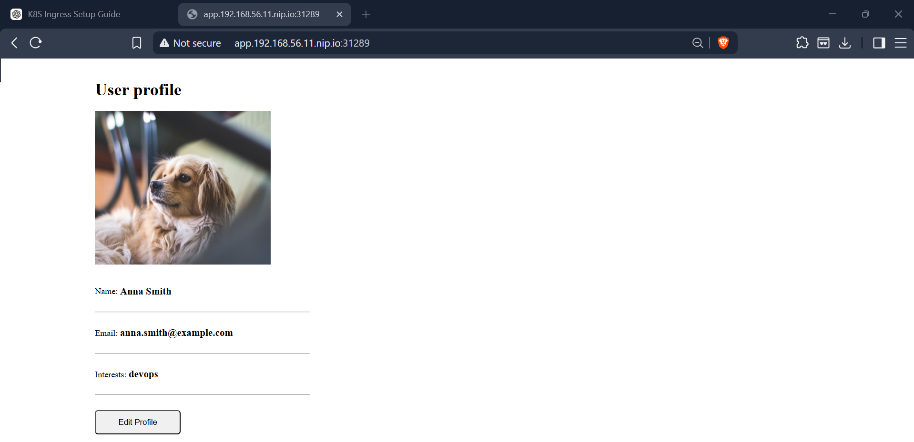

# Kubernetes MongoDB WebApp Demo


A production-style Kubernetes demo project that deploys a containerized web application with MongoDB backend using Kubernetes Deployments, Services, ConfigMaps, Secrets, and NGINX Ingress Controller.

---

## 📌 Project Overview

This project demonstrates:

- Kubernetes Deployments
- ClusterIP Services
- ConfigMaps
- Secrets
- NGINX Ingress
- MongoDB deployment
- Domain-based application access
- Vagrant-based Kubernetes lab setup

The application is deployed inside a Vagrant VM and exposed through NGINX Ingress using `nip.io` wildcard DNS.

---

## 🚀 Architecture


---

## ⚙️ Tech Stack

| Component | Technology |
|---|---|
| Container Orchestration | Kubernetes |
| Web Application | Node.js |
| Database | MongoDB |
| Ingress Controller | NGINX Ingress |
| Virtualization | VirtualBox |
| VM Provisioning | Vagrant |
| Configuration Management | ConfigMaps & Secrets |

---

## 📂 Project Structure

```text
k8s-ingress-mongo-webapp-demo/
│
├── architecture/
│   └── architecture-diagram.png
│
├── kubernetes/
│   ├── mongo-secret.yaml
│   ├── mongo-config.yaml
│   ├── mongo.yaml
│   ├── webapp.yaml
│   └── ingress.yaml
│
├── docs/
│   ├── setup.md
│   ├── ingress-setup.md
│   └── architecture.md
│
├── screenshots/
│   └── web-app.png
│
└── README.md
```

---

## 📦 Kubernetes Components

### MongoDB

- MongoDB Deployment
- Internal ClusterIP Service
- Credentials stored in Kubernetes Secret

---

### Web Application

- Node.js web application
- Exposed internally using ClusterIP Service
- Scaled using Kubernetes Deployment replicas

---

### NGINX Ingress

Ingress routes traffic to the web application using domain-based access.

Example:

```text
http://app.192.168.56.11.nip.io:31289
```

---

## 🔄 Deployment Steps

### 1. Deploy Secret

```bash
kubectl apply -f kubernetes/mongo-secret.yaml
```

---

### 2. Deploy ConfigMap

```bash
kubectl apply -f kubernetes/mongo-config.yaml
```

---

### 3. Deploy MongoDB

```bash
kubectl apply -f kubernetes/mongo.yaml
```

---

### 4. Deploy Web Application

```bash
kubectl apply -f kubernetes/webapp.yaml
```

---

### 5. Deploy Ingress

```bash
kubectl apply -f kubernetes/ingress.yaml
```

---

## 📌 Verify Resources

```bash
kubectl get pods
kubectl get svc
kubectl get ingress
```

---

## 🖥️ Access Application

Application URL:

```text
http://app.192.168.56.11.nip.io:31289
```

---

## 🧪 Example Output

```bash
kubectl get ingress
```

```text
NAME             CLASS   HOSTS                           ADDRESS   PORTS
webapp-ingress   nginx   app.192.168.56.11.nip.io              80
```

---

## 🔄 Ingress Flow

```text
User Browser
      │
      ▼
NGINX Ingress Controller
      │
      ▼
webapp-service
      │
      ▼
Web Application Pods
      │
      ▼
mongo-service
      │
      ▼
MongoDB Pods
```

---

## 🧠 Useful Commands

### Check Pods

```bash
kubectl get pods
```

### Check Services

```bash
kubectl get svc
```

### Check Ingress

```bash
kubectl get ingress
```

### View Pod Logs

```bash
kubectl logs <pod-name>
```

### Describe Resource

```bash
kubectl describe pod <pod-name>
```

---

## 📈 Future Improvements

- HTTPS with cert-manager
- Persistent Volumes
- StatefulSet for MongoDB
- Horizontal Pod Autoscaler
- Monitoring with Prometheus & Grafana
- GitOps with ArgoCD
- CI/CD Integration using GitHub Actions

---

## 📸 Screenshots

### Pods Running



### Ingress Status



### Application - UI




---

## 📂 Documentation

Detailed setup guides:

- [Setup Guide](docs/setup.md)
- [Ingress Setup](docs/ingress-setup.md)
- [Architecture](docs/architecture.md)

---

## 🏁 License

This project is licensed under the MIT License.

---

## 👨‍💻 Author

Joseph M J  
DevOps Engineer
